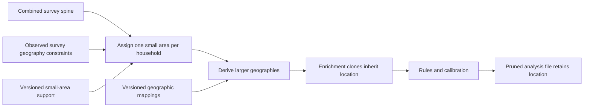

# Geography assignment in the population graph

Design decision, 9 September 2026: assign one small census area to each household
after constructing and harmonizing the survey spine. Derive larger geographies
from that area using identified, versioned mappings. PUF and other enrichment
clones inherit the location. Geographic support expansion, if needed, is a
separate declared population operation with explicit identities and weights.

This document records the intended contract and the implementation gap. It does
not certify a new geographic source, assignment run or population file.

## Declarative country capability

Geography is a declarative country capability backed by shared graph operators.
A country declares its atomic area type, code system and vintage, source mapping
artifacts, observed-geography constraints and sampling-weight convention. The UK
declaration can select an area system by nation. Adding a country should not
require writing a country-specific assignment or derivation kernel.

The shared assignment operator selects the atomic area using the declared
support and stable household identity. Shared lookup/join operations derive
larger geographies from identified mappings. If an input already has a qualified
atomic area, validate and retain it. Source acquisition and normalization may
still require publisher-specific adapters; they produce the common support and
mapping contracts, rather than owning a separate assignment algorithm.

Sampling and derivation remain executable graph operations with typed inputs,
outputs and replay identity. A country configuration does not itself execute
them. Mapping edges retain their relation type, including exact nesting or an
explicit best-fit convention. Prefer existing graph lookup/join primitives where
they support these contracts; introduce only the shared behavior they lack.

The existing country-spec geography declaration is a starting point, but its
legacy clone-and-assign contract and country-specific runtime references do not
yet implement this shared atomic-area contract. Preserve those compatibility
paths while the shared operators and country adapters receive their own checks.

## Country anchors

| Country | Assigned household anchor | Derived geographies |
| --- | --- | --- |
| US | Census block, with census vintage | Block group, tract, county, state, PUMA and congressional district using the declared mapping/boundary vintages |
| England and Wales | 2021 Output Area | LSOA, MSOA, local authority, ward, constituency and region |
| Scotland | 2022 Output Area | Scottish statistical areas, council area, ward, constituency and region |
| Northern Ireland | 2021 Data Zone | Super Data Zone, local government district, constituency and nation |

Northern Ireland's 2021 Data Zones replaced the 2011 Small Areas. Scottish
Output Areas use the 2022 census. These are different source systems; the graph
must retain the original area type and vintage rather than imply identical units.
See [NISRA census output geography](https://www.nisra.gov.uk/statistics/census-2021-results/census-output-geography)
and [Scotland's census general report](https://www.scotlandscensus.gov.uk/about/scotlands-census-2022-general-report/).

Some larger boundaries do not nest exactly. England and Wales small-area estimates
use best-fit mappings for wards and parliamentary constituencies. The derived
edge must identify whether its mapping is exact, best-fit or another explicit
approximation, with its source and vintage. A mapping convention cannot be
presented as observed household location. See the
[ONS methodology](https://www.ons.gov.uk/peoplepopulationandcommunity/populationandmigration/populationestimates/methodologies/smallareapopulationestimatesqmi).

For US congressional districts, the Census Bureau's CD119 block equivalency
file assigns whole original 2020 tabulation blocks to districts. Colorado's
block `080010096072000` crosses the enacted CD07/CD08 boundary but is assigned
to CD08 for tabulation. Represent this as an official tabulation mapping,
not exact spatial containment. The same source distinguishes original 2020
blocks from subsequently adjusted geometry and includes undefined `ZZ` areas.
See the [Census Bureau's CD119 documentation](https://www.census.gov/geographies/mapping-files/2025/dec/rdo/119-congressional-district-bef.html).
By contrast, the same-vintage tract-to-PUMA relation is nested, as described in
the [Census PUMA guidance](https://www.census.gov/programs-surveys/geography/guidance/geo-areas/pumas.html).

## Required behavior

- Respect observed source constraints, such as ACS PUMA and FRS region. Record
  inferred geographic detail as modeled. Preserve observed source geography
  separately from the assigned location.
- Bind each draw to a stable household identity, seed and assignment definition.
  Reordering rows or selecting an existing household must not redraw its location.
  Changed source support or boundary mappings produce a new identified revision.
- Assign household members and enrichment clones consistently. Materialized
  county, district and other fields must agree with the selected anchor's mapping.
- Show assignment and derivation as separate operations in the graph. Expose the
  source constraints, support, sampling weights, mapping conventions and judgment
  annotations in the inspector.
- Refuse missing, ambiguous or incompatible mappings unless an explicit,
  source-supported resolution rule is part of the assignment definition.
- Verify inheritance and mapping consistency again on every pruned export.
  Engine input profiles and geographic build invariants are separate contracts.

## Existing implementation and next changes

The US development composed graph attaches geography after harmonization, but
`us_runtime/graph_geography.py` selects a joint tract/congressional-district cell
and emits PUMA, county and district. It does not assign a Census block. Its prior
national source and joint-support checks therefore do not establish block-first
acceptance. The current survey/clone graph needs an explicit block assignment
and derivation connection before enrichment. Block support and current district
mapping require source review before acquisition or execution.

The UK already has an area-based ladder in `uk_runtime/geography_ladder.py`.
Its sampler selects a constituency within FRS region using household counts,
then an OA within constituency using population; one selected ladder row supplies
the other geographies. It currently consumes a shared seeded random stream, so
stable household-keyed assignment under reordering and subsets still needs work.
The graph should expose the final OA/Data Zone assignment and the mapping
derivations explicitly, including that sampling convention.

The Northern Ireland source builder currently infers Data Zone constituencies
using the modal active-postcode constituency. Review the official
[NISRA constituency aggregation and lookup resources](https://www.nisra.gov.uk/publications/census-2021-output-geography-information-papers)
before choosing or replacing that approximation. Source existence is not
acceptance of a particular lookup or its application to the population.
